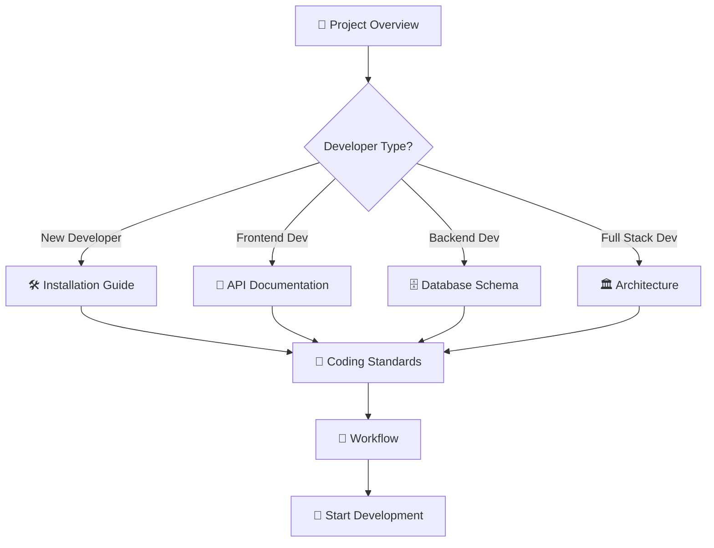

# 📚 LimReview Documentation Index

Chào mừng đến với documentation hub của dự án **LimReview** - Product Review System!

## 🎯 Mục Đích Documentation

Thư mục `docs` này được thiết kế để cung cấp đầy đủ ngữ cảnh và thông tin cho AI, developers, và stakeholders để:

- 🤖 **AI Understanding**: Giúp AI nắm bắt nhanh cấu trúc, logic và đặc điểm của project
- 👨‍💻 **Developer Onboarding**: Hỗ trợ developers mới join project
- 🔧 **Development Support**: Tăng hiệu quả trong việc phát triển, sửa lỗi và tối ưu
- 📊 **Project Management**: Cung cấp overview cho planning và decision making

---

## 📋 Danh Sách Tài Liệu

### 🚀 Getting Started
| Tài Liệu | Mô Tả | Độ Ưu Tiên |
|----------|-------|------------|
| **[📖 Project Overview](./project-overview.md)** | Tổng quan toàn diện về dự án, tech stack và features | ⭐⭐⭐ |
| **[🛠️ Installation Guide](./installation.md)** | Hướng dẫn chi tiết cài đặt và setup môi trường | ⭐⭐⭐ |

### 🏗️ Technical Documentation
| Tài Liệu | Mô Tả | Đối Tượng |
|----------|-------|-----------|
| **[🏛️ System Architecture](./architecture.md)** | Kiến trúc hệ thống, design patterns và technology choices | Architects, Senior Devs |
| **[🔌 API Documentation](./api-endpoints.md)** | Comprehensive API reference với examples | Frontend Devs, API Users |
| **[🗄️ Database Schema](./database-schema.md)** | Database structure, relationships và optimization | Backend Devs, DBAs |

### 👨‍💻 Development Guidelines  
| Tài Liệu | Mô Tả | Đối Tượng |
|----------|-------|-----------|
| **[📏 Coding Standards](./coding-standards.md)** | Code style, conventions và best practices | All Developers |
| **[🔄 Development Workflow](./workflow.md)** | Git workflow, deployment process và team collaboration | All Team Members |

---

## 🗺️ Documentation Navigation Map



---

## 🎯 Cách Sử Dụng Documentation

### 🤖 Cho AI Assistant
1. **Bắt đầu**: Đọc [Project Overview](./project-overview.md) để hiểu context tổng quan
2. **Deep Dive**: Tham khảo [Architecture](./architecture.md) cho technical details
3. **API Integration**: Use [API Documentation](./api-endpoints.md) cho endpoint references
4. **Database Queries**: Check [Database Schema](./database-schema.md) cho data structure
5. **Code Quality**: Follow [Coding Standards](./coding-standards.md) khi generate code

### 👨‍💻 Cho Developers
#### Lần Đầu Join Project
```
1. 📖 Project Overview (15 phút)
2. 🛠️ Installation Guide (30 phút) 
3. 📏 Coding Standards (20 phút)
4. 🔄 Development Workflow (15 phút)
5. 🏛️ Architecture (optional, 30 phút)
```

#### Daily Development
- **API Work**: [API Documentation](./api-endpoints.md)
- **Database Work**: [Database Schema](./database-schema.md)
- **Code Review**: [Coding Standards](./coding-standards.md)
- **Deployment**: [Workflow](./workflow.md)

### 📊 Cho Project Managers
- **Project Status**: [Project Overview](./project-overview.md) - Feature status
- **Technical Decisions**: [Architecture](./architecture.md) - Technology choices
- **Process Overview**: [Workflow](./workflow.md) - Development process

---

## 🔄 Documentation Maintenance

### Update Schedule
- **Weekly**: Project Overview status updates
- **Per Feature**: API và Database documentation
- **Monthly**: Architecture và Workflow reviews
- **Per Release**: All documentation review

### Contribution Guidelines
1. **Accuracy**: Đảm bảo thông tin accurate và up-to-date
2. **Clarity**: Viết clear và concise cho mọi audience
3. **Examples**: Include code examples khi có thể
4. **Consistency**: Follow documentation style guidelines

### Version Control
- Documentation changes theo Git workflow
- Major updates require review
- Breaking changes cần update ngay lập tức

---

## ⚡ Quick Commands

### Development Commands
```bash
# Start development
pnpm tauri dev

# API only
cd databaseAPI && python app.py

# Run tests  
pnpm test && cd databaseAPI && pytest

# Build production
pnpm build && pnpm tauri build
```

### Documentation Commands
```bash
# View API docs
open http://localhost:8000/docs

# Generate schema
pg_dump --schema-only limreview > docs/current-schema.sql

# Update dependencies
pnpm outdated && pip list --outdated
```

---

## 🆘 Support & Resources

### Internal Resources
- **GitHub Issues**: Bug reports và feature requests
- **PR Reviews**: Code quality và knowledge sharing
- **Team Chat**: Real-time communication channel

### External Resources  
- **Tauri**: [tauri.app](https://tauri.app/)
- **FastAPI**: [fastapi.tiangolo.com](https://fastapi.tiangolo.com/)
- **React**: [reactjs.org](https://reactjs.org/)
- **PostgreSQL**: [postgresql.org](https://postgresql.org/)

---

## 📊 Documentation Stats

| Metric | Value |
|--------|-------|
| **Total Documents** | 6 core documents |
| **Total Pages** | ~100+ pages content |
| **Coverage Areas** | Architecture, API, Database, Standards, Workflow |
| **Update Frequency** | Weekly/Per-feature basis |
| **Target Audience** | AI, Developers, PMs, DevOps |

---

## 🎉 Conclusion

Documentation này được thiết kế để:

✅ **Accelerate Development**: Giảm thiểu thời gian onboarding và confusion  
✅ **Improve Code Quality**: Clear standards và best practices  
✅ **Enable AI Assistance**: Comprehensive context cho AI support  
✅ **Facilitate Collaboration**: Shared understanding và processes  
✅ **Support Maintenance**: Long-term project sustainability  

**Happy Coding! 🚀**

---

*Last updated: Generated by AI Assistant*  
*Next review: Per project milestone*